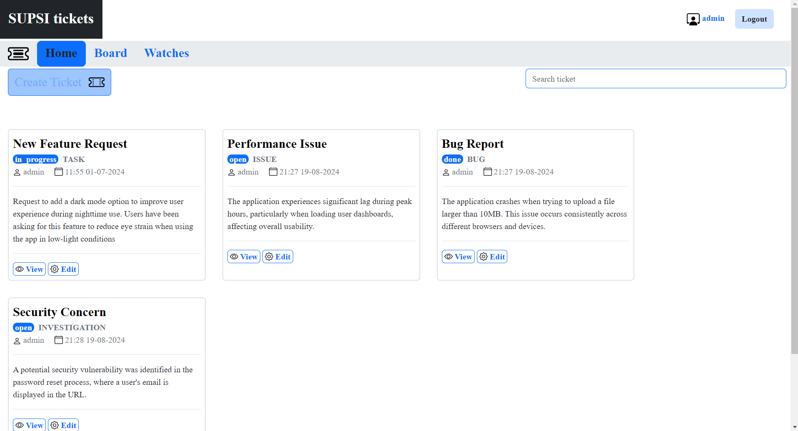
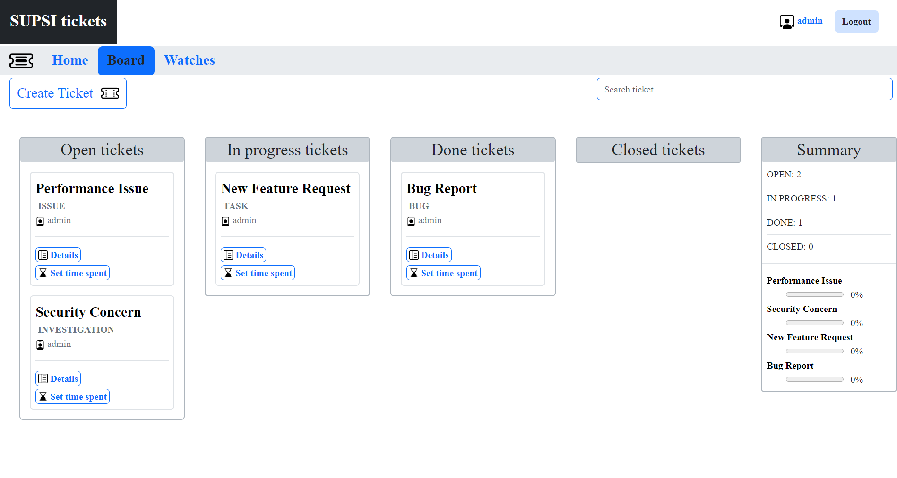

# Ticketing App

A user-friendly ticket management application developed for academic purpuses in 2023 designed to streamline the process of tracking and resolving issues, feature requests, and other tasks within a project.

## Technologies Used

- Spring MVC
- Thymeleaf
- JavaScript
- HTML
- CSS/Bootstrap
- MySQL
- Docker

